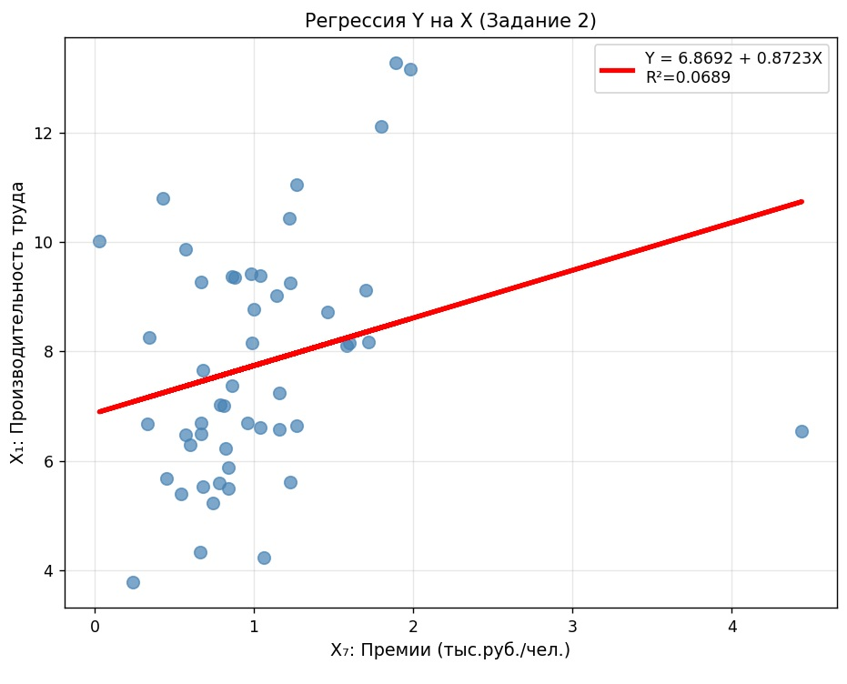
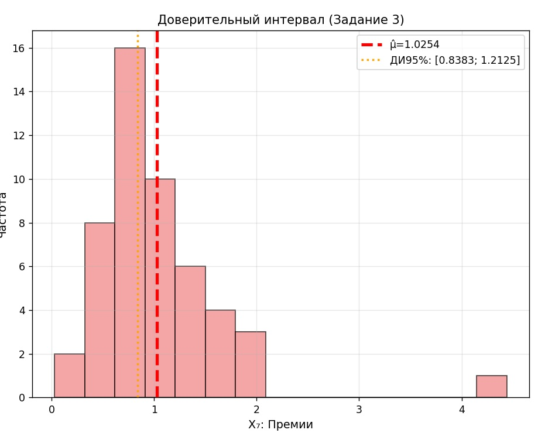

# Проект по теории вероятности и математической статистики

- Контрольная работа №2
- Студент: Степанов Роман Сергеевич
- Группа: ДЗ-2401
- Преподаватель: Докучаев Сергей Аркадьевич
_________
- Дисциплина: Теория вероятности и математическая статистика
- Вариант: 16
__________
...

### Структура проекта:

```
thvarprj/
├── README.md                    # Документация (ты сейчас читаешь)
├── solution.py                 # Основное решение (все 3 задания)
├── enterprises_data.xlsx       # Исходные данные 50 предприятий (вар.16)
├── requirements.txt            # Зависимости Python
└── results/                    # Результаты (автогенерируются)
    └── thvarprj_full_report.png # Графики регрессии + ДИ

```
__________

# 🎓 Теория вероятностей: полный анализ 50 предприятий

#### Цель исследования: Анализ статистических характеристик и взаимосвязи между двумя экономическими показателями деятельности предприятий – премиями на одного работника (X₇) и производительностью труда (X₁).

### Структура решения:
```
1. Описательные статистики: характеристика структуры выборки
2. Линейная регрессия: математическая модель зависимости Y = f(X)
3. Доверительный интервал: точность оценки среднего уровня премий
```

### Методы анализа:
- Статистические характеристики (средняя, СКО, период варьирования).
- Метод наименьших квадратов (МНК) для регрессии.
- t-распределение Стьюдента для доверительных интервалов.

### Ожидаемые результаты:
- Количественная оценка связи между премиями и производительностью.
- Надёжная оценка среднего уровня премий с указанием точности.
- Визуализация зависимости и доверительного интервала.

__________
# ЗАДАНИЕ 1: Описательные статистики
### Цель: Получить полную характеристику двух признаков предприятий

- X7 = премии на одного работника (тыс. руб.)
- X1 = производительность труда (тыс. руб./чел.)

#### Что считаем:

```
n = 50 – количество предприятий (объём выборки)
Выборочная средняя = Σxi/n – средний уровень признака
СКО = √[Σ(xi-¯x)²/(n-1)] – разброс вокруг среднего (выборочная)
Медиана – середина упорядоченного ряда
Мода – наиболее частое значение
Период = (min; max) – диапазон варьирования
Размах = max - min – абсолютный разброс
```

#### Зачем это нужно ???
- Показать структуру данных ДО анализа связи.

### Вывод:
```
Премии (X₇) сильно варьируются: от 0.03 до 4.44 тыс.руб. (размах 4.41).
Производительность (X₁) более однородна: 3.78-13.28 (размах 9.50).
Средние значения: премии 1.03 тыс.руб., производительность 7.76 тыс.руб./чел.
Выборка репрезентативна (n=50), разброс значим (СКО_X₇=0.66, СКО_X₁=2.19).
```
___________
# ЗАДАНИЕ 2: Линейная регрессия Y на X
### Цель: Найти математическую зависимость ("премии → производительность").

#### Что делаем:

```
1. Строим прямую Ŷ = b₀ + b₁X методом наименьших квадратов (МНК)
2. Считаем корреляцию r ∈ [-1;+1] (сила связи)
3. Коэффициент детерминации R² = r² (в % объясняет модель)
4. Проверяем значимость p-value < 0.05
5. Оцениваем Ŷ при медиане X (типичное предприятие)
6. Проверки преподавателя:
   • (n·ȳ - Y₁)/(n-1) – среднее отклонение от первого значения
   • 1 + 3.322·ln(n-1) – поправка для доверительного интервала
```

#### Зачем это нужно ???
- Ответить на вопрос: "увеличивают ли премии производительность и насколько сильно?".

### Вывод:
```
Установлена слабая положительная связь: Y = 6.8692 + 0.8723X
r = 0.2625, R² = 0.0689 (6.89% вариации объяснено премиями)
p-value = 0.0656 (гранично значима на уровне α=0.05)
При медианных премиях (0.87 тыс.руб.) ожидаемая производительность: 7.63 тыс.руб.
Модель статистически допустима, но практическая ценность низкая.
```
_________
# ЗАДАНИЕ 3: Доверительный интервал для μ_X₇
### Цель: Оценить истинное среднее значение премий во всей генерали.

### Что считаем:

```
μ̂ = ¯x = 1.0254 – точечная оценка (средняя выборки)
t(49; 0.975) = 2.0096 – критическое значение t-Стьюдента
s/√n = 0.0931 – стандартная ошибка среднего
Δ = t × (s/√n) = 0.1871 – полуширина интервала
ДИ 95% = [μ̂-Δ; μ̂+Δ] = [0.8383; 1.2125]
```

#### Интерпретация:
- "С вероятностью 95% истинное среднее премий лежит в [0.84; 1.21] тыс.руб."

#### Зачем это нужно ???
- Показать точность оценки среднего (чем уже интервал, тем лучше выборка).

### Вывод:
```
С вероятностью в 95% истинное среднее значение премий лежит в интервале [0.8383; 1.2125] тыс.руб.
Ширина интервала Δ=0.1871 приемлема для n=50 (точность ±18% от среднего).
Оценка ¯x=1.0254 является надёжной точечной оценкой генерального среднего μ_X₇.
```
______________

📊 ГРАФИКИ



> График ко второму заданию



> График к третьему заданию
_________________

# Программа

## Язык программирования:

- Python (ver. `3.12` )

## Зависимости:

- requirements.txt

```
numpy==1.26.4
pandas==2.2.2
scipy==1.13.1
matplotlib==3.8.4
openpyxl==3.1.2
```

## 🚀 ЗАПУСК:

```bash
cd thvarprj
pip install -r requirements.txt
python solution.py
```

> Примечание: для смены значении исходных данных открываем файл `enterprises_data.xlsx`, а дальше - сами разберётесь :)

.../